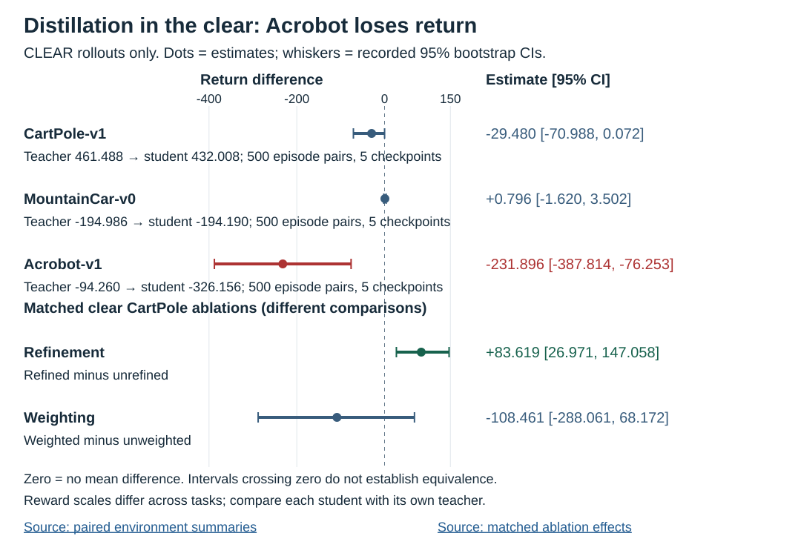
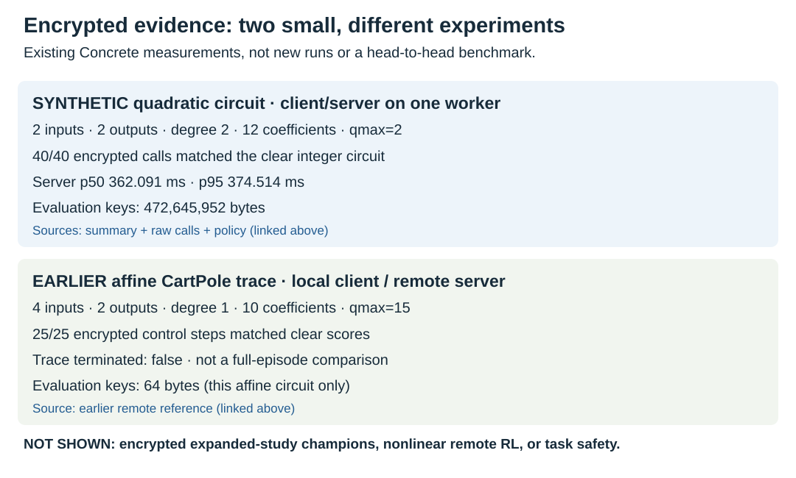

# Unseen Loop

I study whether small control policies can run over encrypted inputs.

**Question:** can I distill a reinforcement-learning teacher into a polynomial cheap enough for fully homomorphic encryption (FHE), without losing closed-loop performance?

**Shown:** a [tiny synthetic quadratic circuit](artifacts/studies/modal-nonlinear-qmax2-002/summary.json) ran under encryption; an [earlier affine CartPole policy](artifacts/reference/modal-smoke-001.json) ran a short remote encrypted trace.

**Not shown:** encrypted reproduction of the larger RL study. Its teacher/student comparison ran **in the clear**, and distillation failed badly on Acrobot. High rounding-certificate coverage did not prevent that loss. The [independent confirmation](artifacts/independent-confirmation-20260904-001/) also failed.

I fit polynomial score policies to clear teacher outputs, quantize their coefficients, and evaluate students on states they actually visit. The idea lives in [the policy](src/unseen_loop/policy.py), [the rounding certificate](src/unseen_loop/certificate.py), and [the FHE backend](src/unseen_loop/fhe_backend.py). Concrete supplies TFHE execution; TenSEAL supplies a separate approximate CKKS experiment. I did not implement these cryptographic libraries.

## Clear RL result: performance did not survive every task

The [paired environment summaries](artifacts/studies/unseen-loop-release-analysis-004/expanded-environments.jsonl) contain five checkpoints and 500 paired teacher/student episodes per environment. These are clear integer-student rollouts, **not encrypted rollouts**.

| Environment | Teacher mean return | Student mean return | Student − teacher, 95% CI |
|---|---:|---:|---:|
| CartPole | 461.488 | 432.008 | −29.480 [−70.988, 0.072] |
| MountainCar | −194.986 | −194.190 | +0.796 [−1.620, 3.502] |
| Acrobot | −94.260 | −326.156 | −231.896 [−387.814, −76.253] |



CartPole and MountainCar intervals include zero; that does not establish equivalence. MountainCar's teacher was itself weak. In the [matched clear CartPole ablation](artifacts/studies/unseen-loop-release-analysis-004/ablation-effects.jsonl), occupancy refinement helped (+83.619 [26.971, 147.058]), but certificate weighting did **not** show a benefit (−108.461 [−288.061, 68.172]). The figure uses the committed bootstrap intervals, not newly computed statistics.

## Encrypted result: small circuits, different claims



The [synthetic policy](artifacts/studies/modal-nonlinear-qmax2-002/policy.json) has two inputs, two outputs, degree two, twelve coefficients, and `qmax=2`. Its [summary](artifacts/studies/modal-nonlinear-qmax2-002/summary.json) and [raw calls](artifacts/studies/modal-nonlinear-qmax2-002/raw.jsonl) record 40/40 matches to clear integer scores, server p50 362.091 ms, and 472,645,952-byte evaluation keys. Client and server shared one Modal CPU worker. This is not a learned RL champion.

The [earlier affine reference](artifacts/reference/modal-smoke-001.json) records 25/25 matching encrypted control steps with a local client and Modal evaluator. It is a short trace, not a full-episode comparison or the nonlinear study.

Larger circuits were expensive: the [shield canary](site/data/flagship-evidence.json) needed 73.916 seconds of server evaluation and 758,473,160-byte keys for one call. The [generated FHE comparison](docs/fhe-fit.md) also covers exact and approximate off-policy evaluation, missing measurements, and negative smoke results. These different experiments are not a scaling law or a service benchmark. The newer ratio-lift comparison remains unexecuted as an encrypted study.

## Reproduce the presentation without cloud compute

From the repository root, use a CPU, Python compatible with `pyproject.toml`, and `uv`:

```bash
uv sync --extra dev
nice -n 19 uv run pytest -q -x tests/test_policy_certificate.py tests/test_teacher_search.py tests/test_experiment_cli.py tests/test_fhe_fit_table.py tests/test_result_figures.py
nice -n 19 uv run python tools/result_figures.py && nice -n 19 uv run python tools/fhe_fit_table.py --output docs/fhe-fit.md
```

These commands test clear behavior and regenerate the source-linked figures/table. They require no paid compute, training, or encrypted execution. The [generator](tools/result_figures.py) uses only Python's standard library. Detailed protocols and earlier process notes remain in the [documentation guide](docs/NEXT.md#retained-documentation).

## Limits

- The certificate proves **float-student versus integer-student argmax agreement** only when its margin condition holds and the circuit executes correctly, not teacher agreement or task safety.
- Training, calibration, distillation, and final client decisions are clear; this is not private training.
- Nonlinear encrypted execution with a physically separate client is [still missing](docs/NEXT.md); the earlier affine trace does not fill that gap.
- Broader shield exact-margin checks and confirmation failed; one canary is not a general safety result.
- The evaluator is honest-but-curious, not a malicious-server correctness guarantee or a production service.

## Prior work and license

I build on [Suh and Tanaka's encrypted RL](https://arxiv.org/abs/2504.09335), [VIPER policy extraction](https://arxiv.org/abs/1805.08328), [Concrete](https://github.com/zama-ai/concrete), and [TenSEAL](https://github.com/OpenMined/TenSEAL), without claiming novelty in FHE plus RL or distillation. See the [references and novelty boundary](docs/paper.md#10-related-work-and-novelty-boundary). Repository code is MIT; external runtimes have their own terms.

Written with AI coding assistance.
