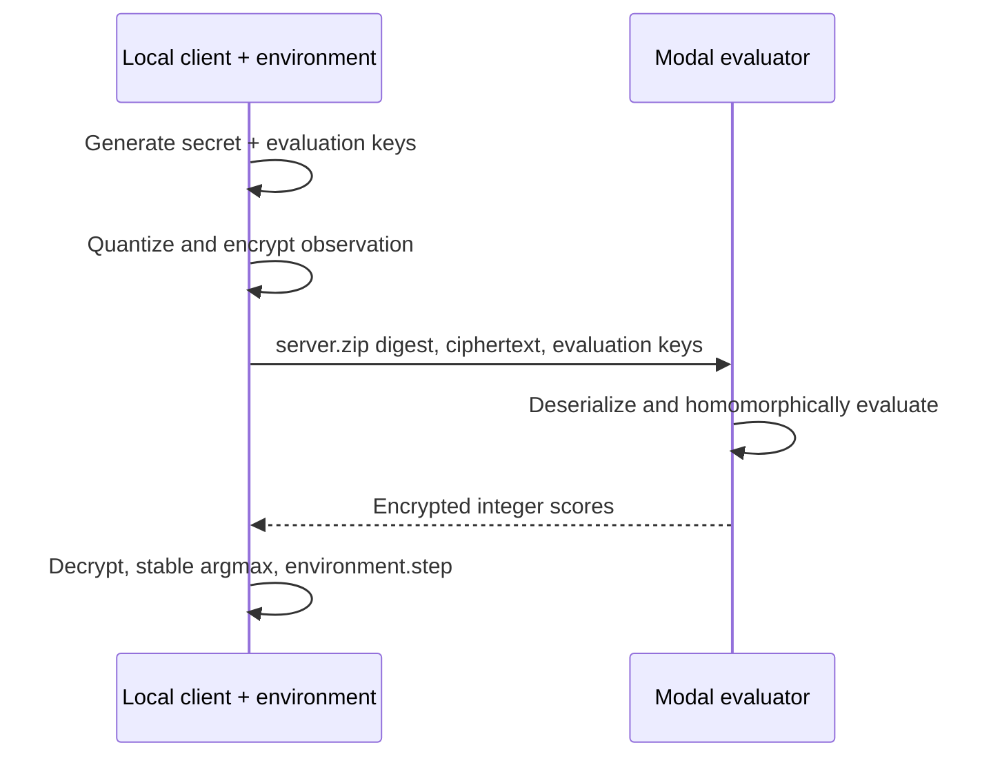

# Unseen Loop: Certificate-Guided Distillation for Encrypted Closed-Loop Policy Serving

**Research artifact · 23 August 2026**

## Abstract

Fully Homomorphic Encryption (FHE) can evaluate a policy without revealing its input to the evaluator, but conventional private-inference benchmarks treat predictions as independent samples. Reinforcement-learning policies violate that assumption: a single changed action changes the future state distribution and can compound into a different return. We introduce **Unseen Loop**, an open research artifact for deterministic discrete-action policy serving over client-key FHE. The system trains a clear RL teacher, distills low-degree integer score policies, searches policy degree and precision against student-induced closed-loop return, analytical action-invariance coverage, and circuit cost, then executes a serialized client/server protocol locally or on Modal.

The central mechanism is a coefficient-rounding certificate. At a quantized state, if the clear student's top-two score margin exceeds twice an analytical per-score error bound, the error-free integer circuit must choose the same greedy action. Uncertified and mismatched student-occupancy states receive greater weight in the next distillation round. The certificate is composed—never conflated—with Concrete's probabilistic whole-circuit correctness configuration.

A recorded CartPole case study trained 2,048 candidate teachers per iteration on an NVIDIA L4, selected a signed 4-bit-input/10-bit-coefficient affine student, and achieved mean held-out return 469 versus the teacher's 500 over eight seeded quick-artifact episodes. The certificate covers 94.1% of held-out occupancy and 98.9867% of all 50,625 integer codes in the declared $[-7,7]^4$ domain. Two client-encrypted, server-evaluated Modal requests matched exact integer-clear outputs; the second recorded server evaluation took 7.799 ms. These are artifact smoke measurements, not population-level or production latency claims. The selected bounded affine circuit ran in Concrete's FHE runtime without requiring bootstrapping; we make no unbounded-depth claim.

## 1. Problem

Let an environment expose private observation $s_t$ to a client. A remote evaluator holds a deterministic score policy $f: \mathcal{S}\rightarrow\mathbb{Z}^{|\mathcal{A}|}$. The client wants

$$
a_t = \operatorname*{argmax}_{a\in\mathcal{A}} f_a(s_t)
$$

without disclosing $s_t$ or the returned score values to the evaluator. The client generates a secret key, encrypts a fixed-shape quantized observation, sends the ciphertext and public evaluation material, receives encrypted scores, decrypts them, applies stable argmax, and advances the environment.

This is not independent classification. If mode $A$ and mode $B$ select different actions at step $t$, then $s_{t+1}^{A}\neq s_{t+1}^{B}$ may hold even in a deterministic environment. Pointwise agreement on a frozen teacher dataset cannot characterize the resulting return or safety cost. Unseen Loop therefore makes **student-induced occupancy** a first-class search and evaluation distribution.

### Scope

- deterministic, discrete-action inference;
- clear training, calibration, distillation, and compilation;
- client-private observations and encrypted score outputs against an honest-but-curious evaluator;
- client-side argmax, so the client learns every returned score;
- bounded integer programs compiled by Concrete-Python 2.10.0.

Not in scope: private RL training, stochastic action sampling, continuous-action certification, malicious-server integrity, circuit privacy, endpoint compromise, traffic-flow confidentiality, or model-extraction resistance.

## 2. Contributions

1. **Closed-loop FHE co-design.** Search degree, observation precision, coefficient precision, and ridge regularization against return, constraint cost, teacher agreement, certificate coverage, estimated integer width, encrypted multiplication count, and measured finalist FHE cost.
2. **Counterexample-guided action certificates.** Derive a sound coefficient-rounding error bound at every reached state, reweight fragile states, and exactly enumerate low-dimensional declared integer domains.
3. **Five-stage semantic ladder.** Keep float teacher, float student, exact integer clear, compiled simulation, and real FHE distinct. Only the final stage is confidentiality and encrypted-latency evidence.
4. **Physical client/server protocol.** Serialize the architecture-specific server artifact, client specifications, ciphertexts, and evaluation material. The Modal evaluator never constructs a client and never receives the secret key.
5. **Evidence-first artifact.** Emit content hashes, range and bit-width receipts, configuration, raw timings, ciphertext sizes and hashes, explicit non-claims, a static interactive report, and deterministic reproduction commands.

We do **not** claim the first use of FHE in RL. Encrypted tabular learning, encrypted policy synthesis, and encrypted deep-RL training predate this artifact [1–3]. The contribution is the combination of closed-loop co-design, action-stability evidence, and real serialized deployment.

## 3. Policy representation

### 3.1 Observation quantization

For feature $i$, calibration freezes center $c_i$, positive step $\Delta_i$, and signed code limit $Q$:

$$
q_i(s)=\operatorname{clip}_{[-Q,Q]}\left(\operatorname{round}\frac{s_i-c_i}{\Delta_i}\right).
$$

Runtime inference rejects an observation outside the compiled domain by default. Clipping exists only as an explicit search/diagnostic behavior; a release client must fail before encryption rather than allow wraparound or silent saturation.

### 3.2 Polynomial score policy

For degree $d\in\{1,2\}$, the integer feature map is

$$
\phi_1(q)=[1,q_1,\ldots,q_n],
$$

$$
\phi_2(q)=[1,q_1,\ldots,q_n,q_1^2,q_1q_2,\ldots,q_n^2].
$$

Weighted ridge regression fits clear coefficients $W\in\mathbb{R}^{A\times D}$ to teacher score vectors. A signed coefficient budget $b_w$ gives $C=2^{b_w-1}-1$. A global scale $\alpha=C/\max|W|$ freezes integer coefficients $\widehat{W}=\operatorname{round}(\alpha W)$. The deployed integer program returns

$$
F(q)=\widehat{W}\phi_d(q).
$$

The same `PolicySpec` drives integer-clear, simulation, and real FHE. No backend retrains weights, changes the quantizer, moves argmax, or changes output semantics.

## 4. Action-invariance certificate

For fixed integer input $q$, define the dequantized integer score $\widehat{g}_a(q)=\widehat{W}_a\phi(q)/\alpha$ and clear student score $g_a(q)=W_a\phi(q)$. Coefficient rounding gives the analytical bound

$$
|g_a(q)-\widehat{g}_a(q)|
\leq
\epsilon_a(q)
=
\sum_j \left|W_{aj}-\frac{\widehat{W}_{aj}}{\alpha}\right|\,|\phi_j(q)|.
$$

Let $a^*=\arg\max_a g_a(q)$ under stable lowest-index tie-breaking and let

$$
m(q)=g_{a^*}(q)-\max_{a\neq a^*}g_a(q),\qquad
\epsilon(q)=\max_a\epsilon_a(q).
$$

### Proposition 1: coefficient-rounding action invariance

If $m(q)>2\epsilon(q)$, then $\arg\max_a g_a(q)=\arg\max_a \widehat{g}_a(q)$.

**Proof.** The winning score can decrease by at most $\epsilon$ and every competing score can increase by at most $\epsilon$. Therefore its post-rounding lead is greater than $m-2\epsilon>0$. ∎

This proposition says nothing about whether the student matches the teacher. It also conditions on correct evaluation of the integer circuit.

### 4.1 Domain certificate

For a low-dimensional quantizer box, Unseen Loop enumerates every integer code, hashes the ordered code stream, evaluates the analytical obligation, and checks for certified mismatches. The CartPole quick artifact enumerates $15^4=50{,}625$ codes. Coverage below 100% is reported directly; an exhaustive run is not mislabeled a complete global action guarantee.

### 4.2 FHE correctness composition

Let the compiler's declared whole-circuit error probability be at most $p_g$. For $H$ encrypted decisions, the union bound gives

$$
\Pr[\text{any circuit-error event in }H\text{ calls}]\leq Hp_g.
$$

No independence assumption is required. This does not turn empirical equality in two trials into an estimate of $p_g$. It only composes a separately configured compiler premise with deterministic coefficient certification.

## 5. Counterexample-guided distillation

For every candidate tuple $(d,b_x,b_w,\lambda)$:

1. collect teacher trajectories on distillation-only seeds;
2. calibrate the quantizer and fit weighted ridge scores;
3. compute per-state action certificates;
4. run the integer student to collect **student-induced** trajectories;
5. query clear teacher scores on those states;
6. multiply weights on uncertified states and integer/float mismatches, with an additional inverse-margin fragility factor;
7. refit without changing the frozen quantizer;
8. evaluate on disjoint seeds and Pareto-filter utility, stability, and cost.

This loop does not claim optimality. It is a deterministic, inspectable grid-search baseline intended to make the RL-specific objective falsifiable.

## 6. Systems design

Compilation is remote because `server.zip` is architecture-specific. Key generation, encryption, decryption, and environment transition execute in the local Modal entrypoint process. The evaluator function accepts only three byte strings: server artifact, encrypted input, and serialized evaluation keys.

The recorded champion is affine. Concrete evaluated its bounded encrypted integer dot product with a fully homomorphic scheme/runtime, but the circuit did not need programmable bootstrapping. The 64-byte evaluation-key payload reflects that circuit structure. Quadratic candidates exercise encrypted-encrypted multiplication and are retained in the search surface, but no quadratic real-FHE result is claimed in the recorded artifact.

## 7. Experimental protocol

### 7.1 Evidence ladder

| Stage | Input | Execution | Valid evidence |
|---|---|---|---|
| Float teacher | float observation | clear MLP | teacher utility |
| Float student | quantized code interpreted in clear | clear polynomial | distillation |
| Quantized clear | integer code | exact exported integer kernel | coefficient rounding and overflow |
| FHE simulated | integer code | compiler graph in clear | compiled semantics only |
| Real FHE | serialized ciphertext | encrypt → server run → decrypt | ciphertext correctness and measured cost |

### 7.2 Recorded quick artifact

Run ID: `modal-smoke-001`. Seed namespaces are content-derived and disjoint for teacher training, distillation, refinement, evaluation, and FHE canaries.

| Field | Recorded value |
|---|---:|
| GPU | NVIDIA L4 |
| Torch / CUDA | 2.7.1+cu126 / 12.6 |
| CEM population × iterations × initial states | 2,048 × 18 × 12 |
| GPU training wall | 9.497 s |
| Teacher held-out return | 500.0 |
| Quantized student held-out return | 469.0 |
| Teacher action agreement | 83.85% |
| Held-out action-certificate coverage | 94.10% |
| Exhaustive box coverage | 98.9867% of 50,625 codes |
| Policy | degree 1, signed 4-bit input, signed 10-bit coefficients |
| Max compiler integer width | 12 bits |
| Server artifact | 7,108 B |
| Request / response | 32,088 B / 16,168 B |
| Cold / warm server evaluation | 43.736 ms / 7.799 ms |
| Real-FHE exact matches | 2 / 2 |

### 7.3 Interpretation

The teacher reaches the environment cap. The distilled integer student loses 31 mean return points but retains long-horizon behavior despite 83.85% pointwise teacher action agreement, illustrating why return and agreement are not interchangeable. Certificate coverage is about float-student versus integer semantics, not teacher agreement.

The latency rows are a smoke trace ($n=2$), not a distribution. We report cold and warm observations individually and do not report p95, throughput, or a “real-time” claim. A release study must run the preregistered repeated-container timing protocol and three task regimes described in `benchmark-protocol.md`.

## 8. Threat model

The evaluator is honest-but-curious, runs a pinned data-independent circuit, and may observe policy/version, tensor shapes, parameter set, ciphertext and evaluation-key sizes, request timing/volume/status, and linkable evaluation-key identity. Assuming secure scheme parameters, fresh client randomness, uncompromised endpoints, and no decryption oracle, FHE computationally hides observation and encrypted-score values.

FHE does not provide result integrity. A malicious evaluator can return any ciphertext or valid but wrong score. Artifact hashes, HMAC envelopes, TLS, and signatures can authenticate a transcript; none proves exact FHE evaluation. The system also does not provide model confidentiality against adaptive query extraction, endpoint protection, availability, side-channel resistance, or secrecy of an action visible through environment effects.

## 9. Related work and novelty boundary

Suh and Tanaka study encrypted RL and comparison-free relative-entropy-regularized synthesis [1]. Encrypted RERL adds bootstrapping and error analysis for encrypted policy synthesis [2]. Nguyen et al. report homomorphic-encryption-compatible SAC training [3]. AutoFHE co-optimizes polynomial degree and bootstrapping placement for neural inference [4]. VIPER distills neural policies into compact verifiable trees [5]. Concrete already exposes quantization, simulation, compilation, and circuit error controls [6].

Accordingly, Unseen Loop does not claim novelty in “FHE + RL,” policy distillation, bit-width search, or the margin inequality alone. Its research unit is the integration of student-induced closed-loop evaluation, deployed-circuit coefficient bounds, counterexample feedback, exact discrete-domain enumeration, and real client/server ciphertext traces in one reproducible artifact.

## 10. Limitations and next experiments

1. The recorded case study is CartPole only and uses one teacher checkpoint. It is conformance evidence, not a multi-task paper result.
2. The champion circuit is affine. Quadratic and TLU baselines require matched real-FHE measurements before circuit-family claims.
3. Certificate coverage is not 100%; behavior at uncertified states remains an empirical property.
4. The current domain certificate enumerates integer codes, not a continuous reachable-set proof.
5. Client-side argmax reveals both scores to the client. In-circuit argmax would change leakage, cost, and circuit semantics.
6. Remote correctness is trusted. Verifiable FHE evaluation is future work, not hidden behind authentication.
7. Timing needs independent containers, shuffled repetitions, peak RSS, and confidence intervals.
8. Model extraction must be evaluated as a query-budget curve before any model-privacy statement.

The preregistered release protocol adds CartPole, MountainCar, and Acrobot; five independently trained checkpoints; 100 paired clear episodes; certificate-disabled and occupancy-disabled ablations; repeated real-FHE challenges; range and tie stress suites; and cold/warm latency distributions.

## References

1. J. Suh and T. Tanaka. “Efficient Implementation of Reinforcement Learning over Homomorphic Encryption.” 2025. <https://arxiv.org/abs/2504.09335>
2. J. Suh and T. Tanaka. “Encrypted Relative-Entropy-Regularized Reinforcement Learning.” 2025. <https://arxiv.org/abs/2506.12358>
3. H. Nguyen et al. “Empowering artificial intelligence with homomorphic encryption for secure deep reinforcement learning.” *Nature Machine Intelligence*, 2025. <https://doi.org/10.1038/s42256-025-01135-2>
4. Y. Ao and S. Boddeti. “AutoFHE: Automated Adaption of CNNs for Efficient Evaluation over FHE.” *USENIX Security*, 2024. <https://www.usenix.org/conference/usenixsecurity24/presentation/ao>
5. O. Bastani, Y. Pu, and A. Solar-Lezama. “Verifiable Reinforcement Learning via Policy Extraction.” 2018. <https://arxiv.org/abs/1805.08328>
6. Zama. “Concrete ML: Compilation and production deployment.” <https://docs.zama.org/concrete-ml/explanations/compilation>
7. HomomorphicEncryption.org. “Homomorphic Encryption Security Standard.” <https://homomorphicencryption.org/standard/>
